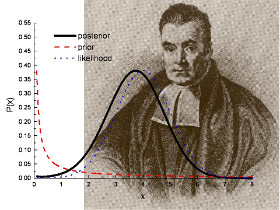
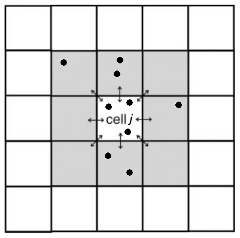

```{r setup, echo=FALSE, message=FALSE}
library(knitr)
opts_chunk$set(
  fig.align="center",
  echo=TRUE,
  message=FALSE,
  warning=FALSE,
  cache=TRUE,
  cache.lazy=FALSE 
)
```

## Introduction

```{r causes, echo=FALSE}
knitr::include_graphics("figures/causes.jpg")
```

Figure caption: **Main causes of deforestation in central Menabe.** **a-a'**: _Slash-and-burn agriculture ("hatsake") for peanut crop._ Peanut (a') is cultivated as a cash crop. Part of the production is at the destination of the national market but most of it is exported outside Madagascar, mainly for the Chinese market. **b-b'**: _Slash-and-burn agriculture for maize crop._ maize (b') is cultivated for auto-consumption and as a cash crop. The production of maize is at the destination of the national market and is used in particular to brew the national beers. **c-c'**: _Cyclone followed by uncontrolled fires._ Cyclone _"Fanele"_ (2009) caused tree mortality and accumulation of wood fuel on the ground. As a consequence, uncontrolled fires set on nearby pastures (c') spread over large areas of forest after 2009. **d-d'**: _Illegal logging._ Timbers are used for house and boat construction.

```{r cc-license, echo=FALSE}
knitr::include_graphics("figures/by-sa.png")
```

This tutorial is licensed under the [Creative Commons Attribution-ShareAlike 4.0 International License](http://creativecommons.org/licenses/by-sa/4.0/).

### Get the tutorial

In RStudio, open a terminal and clone the GitHub repository locally:  
`git clone https://github.com/ghislainv/forecasting-deforestation-Mada`

Navigate with RStudio in the folder named `forecasting-deforestation-Mada` and open the R Notebook file named `training.Rmd`. R Markdown files (`*.Rmd`) can be used in R to embbed text, code, table and figues inside a unique document. Code are organized into 'chunks' that can be executed independently and interactively. An R Notebook is an R Markdown document with output visible immediately beneath the input. 

I used this notebook to write the tutorial available at <https://forestatrisk.cirad.fr/tutorial>.

In the preambule, change the author and date with your name and today's date.

## Computing environment

### R libraries

```{r R_libraries, cache=FALSE}
# Libraries
pkg <- c("reticulate","curl","dplyr","readr","broom",
         "ggplot2","raster","rasterVis","rgdal","leaflet","kableExtra","sf")
load.pkg <- function(x) {
  if(!require(x, character.only=TRUE)) {
    install.packages(x)
    require(x, character.only=TRUE)
  }
}
loaded <- lapply(pkg,load.pkg)
## Remove useless objects
rm(pkg,load.pkg,loaded)
```

```{r source_R, cache=FALSE}
# Source R plotting functions
source("R/far_plot.R")
source("R/perf.R")
```

### Installing Miniconda3 with Python3

To install Miniconda3 with Python3, follow the instructions here: https://conda.io/docs/user-guide/install/index.html

Using functions from the `reticulate` R package, install the conda environment with a selection of Python packages.

```{r condaenv}
library(reticulate)
if (!("forestatrisk" %in% conda_list()$name)) {
	# Create conda virtual environment
	conda_create("forestatrisk")
	# Install python ackages in virtual environment
	conda_pkg <- c("gdal","numpy","pandas","patsy","pip",
				   "matplotlib", "scipy", "scikit-learn",
				   "statsmodels")
	conda_install("forestatrisk", conda_pkg, forge=FALSE)
	# Install forestatrisk from git with pip
	git_repo <- "https://github.com/ghislainv/forestatrisk/archive/master.zip"
	conda_install("forestatrisk", git_repo, pip=TRUE, pip_ignore_installed=FALSE)
	
	py_discover_config(required_module="forestatrisk",
					   use_environment="forestatrisk")
}
```

### Python in R

Specify the Python version to use with reticulate and check that it is the right one.

```{r python_env}
use_condaenv("forestatrisk")
py_config()
```

Import the Python modules into R.

```{r importpy, cache=FALSE}
far <- import("forestatrisk")
patsy <- import("patsy")
sm <- import("statsmodels.api")
smf <- import("statsmodels.formula.api")
plt <- import("matplotlib.pyplot")
```

### R/Python intro

#### R

##### Some links

- <https://www.rstudio.com/online-learning/#r-programming>
- <https://cran.r-project.org/doc/contrib/Paradis-rdebuts_en.pdf> (also in French: _fr.pdf)
- Cheat sheets: <https://www.rstudio.com/resources/cheatsheets>

##### Some exercises

```{r R_exercises}
a <- c(20,5,6,2,9,12)
b <- 1
c <- a + b
print(c)
```

##### Simple regression

```{r R_regression}
# Generating data
nobs <- 100
x.seq <- runif(n=nobs,min=0,max=100)
a.target <- 2
b.target <- 2
sigma2.target <- 300
y.seq <- a.target + b.target*x.seq +
         rnorm(n=nobs,mean=0,sd=sqrt(sigma2.target))

# Data-set
Data <- as.data.frame(cbind(y.seq,x.seq))

# Plot
plot(x.seq,y.seq)

# Estimation
M <- lm(y.seq~x.seq,data=Data)
summary(M)
M$coefficients
var(M$residuals)
M$df

# Graphics 
x.pred <- seq(from=0,to=100,length.out=100) # We will predict y for 100 values of x
X.pred <- as.data.frame(x.pred)
names(X.pred) <- "x.seq"
Y.pred <- predict.lm(M,X.pred,interval="confidence",
                     type="response")

plot(x.seq,y.seq,col=grey(0.7),
     xlab="X",
     ylab="Y",
     main="Simple linear regression") # Row data

# Confidence envelops for predictive posterior
lines(x.pred,Y.pred[,1],col="red",lwd=3)
lines(x.pred,Y.pred[,2],col="blue",lwd=2,lty=2)
lines(x.pred,Y.pred[,3],col="blue",lwd=2,lty=2)
```

#### Python

##### Some links

- <https://www.python.org/about/gettingstarted>
- <https://www.pythonsheets.com>

##### Some exercises

You can execute Python code within a R notebooks. We need to indicate which version of Python to use in the notebook for Python chunk.

```{python example}
import numpy as np
a = np.array([20,5,6,2,9,12])
b = 1
c = a + b
print(type(c))
print(c)
```

## Preparing the data-set

### Downloading the geospatial data

To model the spatial probability of deforestation, we need a map of the past deforestation and maps of potential explicative environmental variables. Environmental variables can be derived from topography (altitude and slope), accessibility (distance to roads, towns, and forest edge), deforestation history (distance to previous deforestation) or landscape policy (protected area network) for example. In our example, we use the following variables :

```{r variables}
tab1 <- read.table("tables/variables.txt",sep=",",header=TRUE)
names(tab1) <- c("Product","Source","Variable derived","Unit","Resolution (m)")
# Kable
knitr::kable(tab1, linesep="") %>%
  kable_styling(bootstrap_options = c("striped"))
```

1. <http://bioscenemada.cirad.fr>, deforestation maps from @Vieilledent2018
2. <http://srtm.csi.cgiar.org>, SRTM 90m Digital Elevation Database v4.1
3. <http://www.geofabrik.de>, data extracts from the OpenStreetMap project for Madagascar,
4. <http://rebioma.net>, SAPM ("Système des Aires Protégées à Madagascar"), 20/12/2010 version

In our example, `fordefor.tif` is a forest raster at 30m for the year 2010 considering the deforestation on the period 2000-2010 in Madagascar. We can plot this raster and zoom on a region with function `.plot.forest()` in the `forestatrisk` package to see the deforestation data. The remaining forest appears in green and the deforested areas appear in red.

```{r plot_fcc}
# Make output directory
if (!dir.exists("output")) {
  dir.create("output")
}
# Plot forest cover change 2000-2010
fig <- far$plot$fcc(input_fcc_raster="data/models/2000-2010/fordefor.tif",
             output_file="output/fcc.png",
             col=c(255,0,0,255),  # rgba color for deforestation
             figsize=c(5,5),
             dpi=150,
             zoom=c(340000,412000,7420000,7500000))
knitr::include_graphics("output/fcc.png")
```

### Sampling points

We use the function `.sample()` from the `forestatrisk` module to sample 10,000 points (pixel centers) in the deforested areas and in the remaining forest (20,000 points in total). The `input_forest_raster` argument defines the path to the forest raster including the deforested pixels (with value=0) and the remaining forest pixels (value=1) after a given period of time. The random seed can be set with argument `Seed` to reproduce the data of the random sampling.

The `.sample()` function also extracts information from environmental variables for each sampled point. Sampling is done by block to allow the computation on large study areas (e.g. country or continental scale) with a fine spatial resolution (e.g. 30m). The `var_dir` argument indicates the directory including all the environmental raster files (they must be GeoTIFF files with extension `.tif`) that we want to test.

The `.sample()` function identifies the spatial cell for each sample point (sample point are grouped within a spatial cell). Spatial cells and grouped observations are used to estimate the spatial autocorrelation of the deforestation process. The `csize` argument define the width (in km) of the square spatial cells. Each spatial cell will be attributed a parameter. To avoid estimating too many parameters, width of the square spatial cells must be sufficiently large. Both points sampling and extraction of environmental data are done by block to avoid memory problems for big datasets.

```{python help-sample"}
import forestatrisk as far
help(far.sample)
```

```{r sampling, results="hide"}
# Training and validation data-set
if (!file.exists("output/sample-2000-2010.txt")) {
  samp <- far$sample(nsamp=20000L, Seed=1234L, csize=10L,
                     var_dir="data/models/2000-2010",
                     input_forest_raster="fordefor.tif",
                     output_file="output/sample-2000-2010.txt",
                     blk_rows=1L)
}
samp <- read.table("output/sample-2000-2010.txt", header=TRUE, sep=",")
set.seed(1234)
train <- sample(1:40000, size=20000, replace=FALSE)
data_train <- samp[train,] %>% dplyr::filter(complete.cases(.))
data_valid <- samp[-train,] %>% dplyr::filter(complete.cases(.))
```

```{r visu_sampling}
head(data_train)
```

Sampled observations can be plotted using function `.plot.obs()` from the forestatrisk module. Dark red dots indicate deforestation observations and dark green dots indicate forest observations.

```{r plot_sample}
# Plot sample points
fig <- far$plot$obs(sample=data_train,
             name_forest_var="fordefor",
             input_fcc_raster="data/models/2000-2010/fordefor.tif",
             output_file="output/obs.png",
             zoom=c(340000,412000,7420000,7500000),
             figsize=c(5,5),#c(11.69,8.27),
             s=5,dpi=300)
knitr::include_graphics("output/obs.png")
```

### Descriptive statistics

Before modelling the deforestation, it is important to look at the relationship between environmental variables and deforestation. Using formulas from the [`patsy`](https://github.com/pydata/patsy) Python module, we can specify the relationships that we want to look at. In the example below, we plot the relationships between some continuous environmental variables and the probability of deforestation using function `.plot.correlation()` from the `forestatrisk` package. Note that -1 must be set at the end of the formula. The function `.correlation()` returns a serie of graphics that can be analyzed to choose the right relationship for each continuous variable (linear or polynomial for example).

```{r correlations}
# Descriptive statistics

# Model formulas
formula_1 <- paste0("fordefor ~ dist_road + dist_town + dist_defor +",
                    "dist_river + dist_edge + altitude + slope - 1")
# Standardized variables (mean=0, std=1)
formula_2 <- paste0("fordefor ~ scale(dist_road) + scale(dist_town) +",
                    "scale(dist_defor) + scale(dist_river) + scale(dist_edge) +",
                    "scale(altitude) + scale(slope) - 1")
formulas <- c(formula_1, formula_2)

# Loop on formulas
for (f in 1:length(formulas)) {
    # Output file
    of <- paste0("output/correlation_",f,".pdf")
    # Data
    dmat <- patsy$dmatrices(formulas[f], data=data_train, eval_env=-1L,
                                  return_type="dataframe")
    # Plots
    fig <- far$plot$correlation(y=dmat[[1]],data=dmat[[2]],
                         plots_per_page=3L,figsize=c(7,8),
                         dpi=100L,output_file=of)
}
```

In this example (see pdf files produced), we can see that a linear model should be sufficient to represent the relationship between the probability of deforestation and the standardized distance to the nearest road or town. On the contrary, it might be interesting to fit a polynomial model for the the standardized distance to previous deforestation (`dist_defor` variable) for which the relationship seems non-linear. Several models can be fitted and compared to see if a second-order or third-order polynomial relationship is justified.

## Deforestation model

We propose to use the **Binomial icar** model [@Vieilledent2014] to estimate the deforestation probability of a pixel given a set of environmental variables. The Binomial icar model is a linear Binomial logistic regression model including an intrinsic Conditional Autoregressive (icar) process to account for the spatial autocorrelation of the observations. Parameter inference is done in a hierarchical Bayesian framework. The `.model_binomial_icar()` function from the `forestatrisk` module includes a Metropolis-within-Gibbs algorithm written in pure C code to reduce computation time.

```{r Bayes, out.width="40%", echo=FALSE}

```

Figure caption: **Parameter inference is done in a hierarchical Bayesian framework.** Bayesian statistics rely on the [Bayes' theorem](https://en.wikipedia.org/wiki/Bayes'_theorem) named after [Reverend Thomas Bayes](https://en.wikipedia.org/wiki/Thomas_Bayes). Each parameter has a prior and an approximated posterior probability distribution from which we can compute the mean, standard deviation, credible intervals at 95%, etc.

For the deforestation process it is _**very important to take into account the spatial autocorrelation of the process**_ with spatial random effects. Indeed, the selected fixed environmental variables are not able to fully explain the spatial variability of the deforestation process, especially when working at large geographical scales, such as the national or continental scale. Spatial random effects allow estimating a higher/lower probability of deforestation in a particular region (associated to **unmeasurable** or **unknow** factors) that is different from the mean probability of deforestation derived from the environmental factors included in the model. The Binomial icar model can be described as follow:

**Ecological process**

\begin{equation}
y_i \sim \mathcal{B}inomial(\theta_i,t_i) \\
\text{logit}(\theta_i) = X_i \beta + \rho_{j(i)}
\end{equation}

$y_i$: random variable for the deforestation process (0 if no deforestation, 1 if deforestation)

$\theta_i$: probability of deforestation

$t_i$: number of trials (always 1 in our example)

$X_i$: vector of values for environmental explicative variables

$\beta$: vector of fixed effect parameters

$\rho_j$: spatial random effect
  
$j(i)$: index of the spatial entity for observation $i$.
  
**Spatial autocorrelation**
  
The spatial autocorrelation is modelled with an intrinsic conditional autoregressive (icar) process:

\begin{equation}
\rho_j \sim \mathcal{N}ormal(\mu_j,V_{\rho} / n_j)
\end{equation}

$\mu_j$: mean of $\rho_{j'}$ in the neighborhood of $j$.
  
$V_{\rho}$: variance of the spatial random effects.
  
$n_j$: number of neighbors for spatial entity $j$.

```{r icar_process, out.width="40%", echo=FALSE}

```

Figure caption: **Representation of the neighborhood for the intrinsic conditional autoregressive (icar) process.** Target spatial cell $j$ has 8 neighbors in this case. Several observations (black points, equivalent to pixel centers in our case) can be located in each spatial cell. Deforestation probability in one spatial cell $j$ depends on deforestation probability in neighboring cells.

### Spatial cells

Before running the model, we add a column indicating the number of trials for each observation (1 in our case as we are considering a Bernoulli process). We then remove any observation with non-available data (NA) from the data-set. We also compute the number of neighbors (`nneigh`) and the neighbor identifiers (`adj`) for each spatial cell using function `.cellneigh` from the `forestatrisk` module.

```{r spatial_cells}
# Spatial cells for spatial-autocorrelation
neighborhood <- far$cellneigh_ctry(raster="data/models/2000-2010/fordefor.tif",
                                   vector="data/mada/mada38s.shp",
                                   csize=10L, rank=1L)
nneigh <- neighborhood[[1]]
adj <- neighborhood[[2]]
cell_in <- neighborhood[[3]]
ncell <- neighborhood[[4]]

# Udpate cell number in training dataset
cell_rank <- vector()
for (i in 1:nrow(data_train)) {
  cell_rank[i] <- which(cell_in==data_train$cell[i])-1 # ! cells start at zero
}
data_train$cell <- cell_rank

# Udpate cell number in validation dataset
cell_rank <- vector()
for (i in 1:nrow(data_valid)) {
  cell_rank[i] <- which(cell_in==data_valid$cell[i])-1 # ! cells start at zero
}
data_valid$cell <- cell_rank
```

### Model formula

A model formula must also be defined to specify the explicative variables we want to include in the model. The formula allows specifying some variable transformations (such as standardization in our case). See the [`patsy`](https://patsy.readthedocs.io/en/latest/) module for more information. In our model, we included the following variables: location inside a protected area, altitude, distance to past deforestation (with a degree two polynomial), distance to forest edge, distance to nearest road and distance to nearest town. The formula must end with the name of the variable indicating the spatial cell for each observation (`cell` in our case).

```{r formula}
# Formula
data_train$trials <- 1  # Set number of trials to one
formula <- paste0("I(1-fordefor) + trials ~ C(sapm) + scale(altitude) + ",
                  "scale(slope) + scale(dist_defor) + scale(dist_edge) + ",
                  "scale(dist_road) + scale(dist_town) + cell")
```

### Fitting model parameters

```{r mod_icar, cache=FALSE}
# Model
mod_icar <- far$model_binomial_iCAR(
  # Observations
  suitability_formula=formula, data=data_train,
  # Spatial structure
  n_neighbors=np_array(nneigh,dtype="int32"), neighbors=np_array(adj,dtype="int32"),
  # Environment
  eval_env=-1L,
  # Chains
  #burnin=2000L, mcmc=5000L, thin=5L,
  burnin=1000L, mcmc=1000L, thin=1L,
  # Starting values
  beta_start=-99)
```

### Model summary

Once the model has been fitted, we can print a summary of the model showing the parameter estimates. The 95% credible intervals obtained from the posterior distribution of each parameter, except distance to nearest town (`dist_town`), do not include zero, indicating that parameters are significantly different from zero. The variance of the spatial random effects (`Vrho`) is given together with the deviance value, which can be used to compare different statistical models (lower deviance is better). Looking at the parameter estimates, we can see that the deforestation probability is much lower inside protected areas and that deforestation probability decreases with altitude, slope, distance to past deforestation, forest edge, roads and towns. Parameter values are then coherent regarding the deforestation process and easy to interpret.

```{r summary_icar}
sink(file="output/summary_mod_icar.txt")
print(mod_icar)
sink()
print(mod_icar)
```

### Plot traces and posteriors

To check for the convergence of the Markov chain Monte Carlo (MCMC), we can plot the traces and the posterior distributions of the estimated parameters using method `.plot()` associated to the `hSDM_binomial_icar` class defined in the `deforestprob` module. This method returns the figures showing the traces and posterior distributions.

```{r plot_with_py, echo=FALSE}
traces_fig <- mod_icar$plot(output_file="output/mcmc.pdf",
                            plots_per_page=3L,
                            figsize=c(9,6),
                            dpi=100)
```

```{r plot_with_r}
require(coda)
mcmc <- as.mcmc(mod_icar$mcmc)
plot(mcmc[,c(1:3,9,10)])
```

### Spatial random effects

```{r rhos}
# Get the spatial random effects
rho <- rep(-9999,ncell)  # -9999 will be considered as nodata
rho[cell_in+1] <- mod_icar$rho

# Plot random effects
fig <- far$plot$rho("output/rho_orig.tif",output_file="output/rho_orig.png")

# Plot with R
mada <- rgdal::readOGR(dsn="data/mada",layer="mada38s", verbose=FALSE)
r_rho_orig <- raster("output/rho_orig.tif")
rho_plot(r_rho_orig, mada, output_file="output/rho_orig_ggplot.png",
         quantiles_legend=c(0.025,0.975),width=4.5, height=8)
```

## Forecasting deforestation

### Resampling the spatial random effects

We use the model to predict the spatial probability of deforestation at the national scale for Madagascar. Before, doing so, we smooth the spatial random effects which have been estimated at a coarse resolution (10km in our example). To do so, we use the function `.resample_rho()` from the `deforestprob` module to resample the results at a finer resolution using a bilinear interpolation. The function writes a raster file to the disk with a resolution of the raster specified in the argument `input_raster` of the function (1km in our case). The function `.resample_rho()` returns a figure of the spatial random effects that can be plotted.

```{r resampling_rho, fig.height=7, message=FALSE, warning=FALSE}
# Resample them
fig <- far$interpolate_rho(rho=r_to_py(rho), input_raster="data/models/2000-2010/fordefor.tif",
                 output_file="output/rho.tif",
                 csize_orig=10L, csize_new=1L)

# Plot random effects
fig <- far$plot$rho("output/rho.tif",output_file="output/rho.png")

# Plot with R
r_rho <- raster("output/rho.tif")
rho_plot(r_rho, mada, output_file="output/rho_ggplot.png",
         quantiles_legend=c(0.025,0.975),width=4.5, height=8)
```

### Spatial probability of deforestation in 2010

The `.predict_raster_binomial_icar()` function of the `forestatrisk` module can be used to predict the spatial probability of deforestation from an **hSDM_binomial_icar** model (i.e. an object of class `hSDM_binomial_icar`). The function writes a raster of predictions to the disk. The prediction is done by block to avoid memory problems for big datasets. Functions will return NA for pixels with no forest or for pixels with missing environmental variables.

```{r compute_predictions}
if (!file.exists("output/prob_icar.tif")) {
  far$predict_raster_binomial_iCAR(
    mod_icar, var_dir="data/models/2000-2010",
    input_cell_raster="output/rho.tif",
    input_forest_raster="data/models/2000-2010/fordefor.tif",
    output_file="output/prob_icar.tif",
    blk_rows=128L)
}
```

The raster of predictions can then be plotted.

```{r plot_predictions}
if (!file.exists("output/prob_icar.png")) {
  fig <- far$plot$prob("output/prob_icar.tif",
                       output_file="output/prob_icar.png",
                       figsize=c(4,4))
}
knitr::include_graphics("output/prob_icar.png")
```

```{r sapm, eval=FALSE, include=FALSE}
sapm <- raster("data/models/2000-2010/sapm.tif")
plot(sapm, maxpixels=100000)
plot(mada, col="transparent", add=TRUE)
```

### Predicting future forest cover

Given the spatial probability of deforestation and the number of hectares that should be deforested, we can predict the future forest cover using function `.deforest()` from the `forestatrisk` package. The number of hectares are converted into number of pixels to be deforested. Pixels with the highest probability of deforestation are deforested first. The function computes a probability threshold above which pixels are deforested.

In our example, we consider an annual deforestation of roughly 100,000 ha for Madagascar. Considering the period 2010-2050, this would correspond to 4 Mha of deforestation. This number can of course be more precise and refined considering various deforestation scenarios (demographic growth, economic development, etc.).

```{r compute_future_forest_cover, results="hide"}
if (!file.exists("output/proj2050_icar.tif")) {
  deforest <- far$deforest(input_raster="output/prob_icar.tif",
                           hectares=4000000,
                           output_file="output/proj2050_icar.tif",
                           blk_rows=128L)
}
```

We can plot the predicted future forest cover in 2050 with [leaflet](http://rstudio.github.io/leaflet/). We first reproject the raster to WGS 84 / World Mercator projection ([EPSG:3857](http://spatialreference.org/ref/sr-org/7483/)) and we resample the map at 250 m using function `gdalwarp` from `GDAL`. The 250 m resolution raster that can be transformed into a lower size image that can be plotted with leaflet.

```{bash resample}
if [ ! -f output/proj2050_icar_epsg3857_ov32.tif ]
then
  gdalwarp -overwrite -s_srs EPSG:32738 -t_srs EPSG:3857 -tr 250 250 \
         -ot Byte -r near -co "COMPRESS=LZW" -co "PREDICTOR=2" -co "BIGTIFF=YES" \
         output/proj2050_icar.tif output/proj2050_icar_epsg3857_ov32.tif
fi
```

We also set the color of the map and the extent of the view for leaflet.

```{r col_leaflet}
# Colors and extent view for leaflet
r <- raster("output/proj2050_icar_epsg3857_ov32.tif")
red_rgb <- c(225,26,28)
forestgreen_rgb <- c(51,160,44) 
rgbColors <- matrix(c(red_rgb,forestgreen_rgb), ncol=3, byrow=TRUE)
Colors <- rgb(rgbColors/255)
pal <- colorFactor(Colors, c(0,1), na.color = "transparent")
ext_PK32 <- c(340000,412000,7420000,7500000) # PK32-Ranobe
r1 <- raster(nrows=1,ncols=1,ext=extent(ext_PK32),
             crs=CRS("+init=epsg:32738"))
r2 <- projectExtent(r1, crs=CRS("+init=epsg:4326"))
ext2 <- extent(r2)
```

The red areas represent the deforestation on the period 2010-2050. The green areas represent the remaining forest in 2050. Most of the remaining forest in 2050 are inside the protected areas or located in remote areas, at high altitudes and far from roads and big cities (for example in the Tsaratanana mountain region and around the Masoala peninsula, north-east Madagascar).

```{r fcc_leaflet, out.width="100%", cache=FALSE}
# Leaflet map
m <- leaflet() %>% addTiles() %>%
  addRasterImage(r, colors=pal, opacity=0.8, project=FALSE) %>%
  addLegend(colors=Colors,
  		  labels=c("defor 2010-2050","forest 2050"),
  		  position="bottomleft") %>%
  #fitBounds(ext2@xmin,ext2@ymin,ext2@xmax,ext2@ymax)
  setView(lng=46.3, lat=-19.7, zoom=7)
m
```

## Model comparison

### Model types

- null model
- glm model: simple glm with no spatial random effect model

```{r null_model, cache=FALSE}
# Null model
formula_null <- "I(1-fordefor) ~ 1"
dmat_null <- patsy$dmatrices(formula_null, data=r_to_py(data_train), NA_action="drop",
                             return_type="dataframe", eval_env=-1L)
Y <- dmat_null[[1]]
X_null <- dmat_null[[2]]
mod_null <- sm$GLM(Y, X_null, family=sm$families$Binomial())$fit()
print(mod_null$summary())
```

```{r glm_model, cache=FALSE}
# Simple glm with no spatial random effects
formula_glm <- paste0("I(1-fordefor) ~ C(sapm) + scale(altitude) + ",
                       "scale(slope) + scale(dist_defor) + ",
                       "scale(dist_edge) + scale(dist_road) + scale(dist_town)")
mod_glm <- smf$glm(formula_glm, r_to_py(data_train),
									 family=sm$families$Binomial(), eval_env=-1L)$fit()
# Summary glm
sink(file="output/summary_mod_binomial_glm.txt")
print(mod_glm$summary())
sink()
print(mod_glm$summary())
```

### Deviance explained

```{r deviance}
# Deviances
deviance_null <- mod_null$deviance
deviance_glm <- mod_glm$deviance
deviance_icar <- mod_icar$deviance
deviance_full <- 0
# Table
dev <- c(deviance_null, deviance_glm, deviance_icar, deviance_full)
mod_dev <- data.frame(model=c("null", "glm", "icar", "full"),
                  deviance=round(dev))
perc <- 100*(1-mod_dev$deviance/deviance_null)
mod_dev$perc <- round(perc)
write.table(mod_dev,file="output/deviance_model_comparison.txt",sep=",",row.names=FALSE)
mod_dev
```

### Spatial cross-validation 

Using the validation data-set, we can compute several model performance indices [@Liu2011]:

- FOM: figure of merit
- OA: overall accuracy
- EA: expected accuracy
- Spe: specificity
- Sen: sensitivity
- TSS: true skill statistics
- K: kappa of Cohen
- AUC: area under the (ROC) curve

It is known that the value of some of these indices might vary with the intensity of deforestation [@Pontius2008]. 

```{r fig_Pontius, echo=FALSE}

```

In our case, we compute these indices for various values of the deforestation rate (in percentage of deforestation observations) in our validation data-set (1, 5, 10, 25, 50). For each percentage, the threshold used to convert the predicted probabilities of deforestation were choosen in order to respect the deforestation rate (in %) in the observations.   

```{r spatial-cross-validation}
set.seed(1234)
performance_null <- performance_index(data_valid,runif(nrow(data_valid)))
performance_nochange <- performance_index(data_valid,rep(0,nrow(data_valid)))
theta_pred <- rep(0,nrow(data_valid))
performance_glm <- performance_index(data_valid,mod_glm$predict(data_valid))
performance_icar <-performance_index(data_valid,mod_icar$predict(data_valid))
# Save
write.table(performance_null, file="output/performance_null.txt",
			sep="\t", row.names=FALSE)
write.table(performance_nochange, file="output/performance_nochange.txt",
			sep="\t", row.names=FALSE)
write.table(performance_glm, file="output/performance_glm.txt",
			sep="\t", row.names=FALSE)
write.table(performance_icar, file="output/performance_icar.txt",
			sep="\t", row.names=FALSE)
# Save for perc=10%
df_mod_valid <- rbind(performance_null[5,],performance_nochange[5,],
					  performance_glm[5,],
					  performance_icar[5,])
df_mod_valid <- df_mod_valid %>%
	dplyr::mutate(mod=c("null","nochange","glm","icar")) %>%
	dplyr::select(10,2:9)
write.table(df_mod_valid, file="output/df_mod_valid.txt", sep="\t", row.names=FALSE)

# Print
df_mod_valid
```

### Comparing predictions on the long term

#### Predictions with GLM

We use the glm model to predict the spatial probability of deforestation.

```{r prob_glm}
if (!file.exists("output/prob_glm.tif")) {
	fig_prob <- far$predict_raster(
		mod_glm, var_dir="data/models/2010-2017",
		input_forest_raster="data/forest/for2010.tif",
		output_file="output/prob_glm.tif",
		blk_rows=128L, transform=TRUE)
}
```

We use the glm model to predict the forest cover in 2050.

```{r proj2050_glm}
if (!file.exists("output/proj2050_glm.tif")) {
  deforest <- far$deforest(input_raster="output/prob_glm.tif",
                           hectares=4000000,
                           output_file="output/proj2050_glm.tif",
                           blk_rows=128L)
}
```

#### Plotting differences

We compute the differences between glm and icar models for forest cover predictions in 2050.

```{r comp_diff}
if (!file.exists("output/diff2050_icar_glm.tif")) {
	far$r_diffproj(inputA="output/proj2050_icar.tif",
				   inputB="output/proj2050_glm.tif",
				   output_file="output/diff2050_icar_glm.tif",
				   blk_rows=128L)
}
```

We plot the difference with function `far.plot.differences()`.

```{r plot_diff}
if (!file.exists("output/diff2050_icar_glm.png")) {
    far$plot$differences("output/diff2050_{comp[i]}.tif",
                         borders="data/mada/mada38s.shp",
                         output_file="output/diff2050_icar_glm.png")
}
```

We can also plot with ggplot2

```{r plot_diff_ggplot, cache=FALSE}
r_diff <- resamp2df(input_file="output/diff2050_icar_glm.tif",
                    output_file="output/diff2050_icar_glm_1km.tif",
                    res=1000)
mada <- rgdal::readOGR(dsn="data/mada",layer="mada38s")
rect_df <- data.frame(xmin=c(346000,793000), xmax=c(439000,886000),
                      ymin=c(7387000,7815000), ymax=c(7480000,7908000),
                      id=c(1,2))
p <- diff_plot(input_df=r_diff,
               input_vector=mada,
               output_file="output/diff2050_icar_glm_ggplot.png",
               rect=rect_df)
p
```


## References